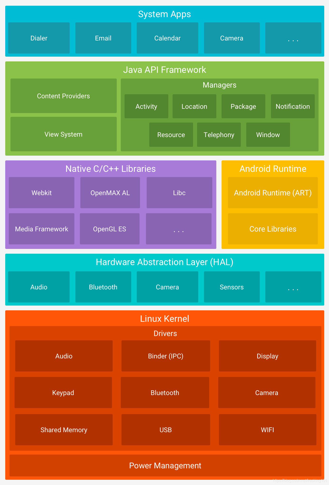

# Android系统架构

<!--more-->

我们主要开发的是App层，但是需要重点了解的是Framework层：

### Java API Framework

| 名称                | 功能                                  |
| ------------------- | ------------------------------------- |
| ActivityManager     | 管理各个应用的生命周期                |
| PackageManager      | 管理所有安装在Android系统中的应用程序 |
| ResourceManager     | 提供App需要的各种非代码资源           |
| WindowManager       | 管理所有开启的窗口程序                |
| ViewSystem          | 构建App的基本组件                     |
| ContentProvider     | 再不同App之间共享数据                 |
| LocationManager     | 提供定位功能                          |
| NotificationManager | 通知管理                              |
| TelephoneManager    | 电话管理器，管理所有的移动设备功能    |

### 系统运行库

#### Native C/C++Libraries

包含Webkit、openGL什么的。

#### Android Runtime 安卓运行时库

- Core Libraries 核心库，提供了java语言核心库的功能，和Android自带的一些语法糖、工具类；
- AndroidRuntime 安卓运行时，从5.0开始从 Dalvik变更为ART。

##### 两个安卓运行时的区别

- Dalvik 允许在有限的内存中同时运行多个虚拟机实例，并且相互隔离，即时一个崩了，也不会影响其他实例，每一个实例都作为一个单独的Linux进程运行。边解释边执行，需要依靠JIT(即时编译器)把字节码转换成机器码，运行效率低；
- ART 在安装过程中把字节码预编译成机器码，执行效率高。

### 硬件抽象层

其实就类似接口隔离，统一了不同厂商硬件调用的外观。

### Linux内核层

一个linux系统，并且嵌入了Android专用的各种驱动。

