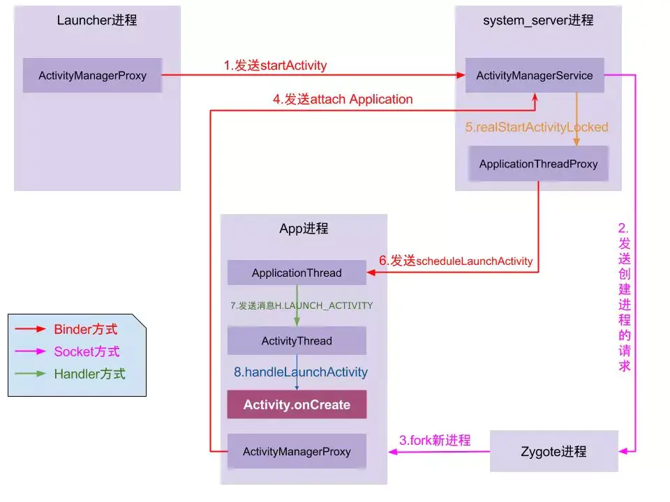

## 流程

1. 点击桌面App图标，Launcher进程采用Binder IPC向system_server进程发起startActivity请求；
2. system_server进程接收到请求后，向zygote进程发送创建进程的请求；
3. Zygote进程fork出新的子进程，即App进程；
4. App进程，通过Binder IPC向sytem_server进程发起attachApplication请求；
5. system_server进程在收到请求后，进行一系列准备工作后，再通过binder IPC向App进程发送scheduleLaunchActivity请求；
6. App进程的binder线程（ApplicationThread）在收到请求后，通过handler向主线程发送LAUNCH_ACTIVITY消息；
7. 主线程在收到Message后，通过发射机制创建目标Activity，并回调Activity.onCreate()等方法。
8. 到此，App便正式启动，开始进入Activity生命周期，执行完onCreate/onStart/onResume方法，UI渲染结束后便可以看到App的主界面。

## zygote（fork自己，不断增生）

`zygote`意思是受精卵，有分裂增生的意思。

它在Android中是一个独立的**进程**.

在linux中，所有的进程都是从`init进程`中fork出来的。当系统启动后会自动从init进程fork出一个`zygote`进程，当需要启动App时，会从这个初始`zygote`再fork出新的进程。

zygote被fork出来要做的就是通过binder向`sytem_server`发送`attachApplication`请求。

所以这货就两个作用：

1. fork自己；
2. 通知`sytem_server`附加Application。

## system_server

system_server也是一个独立的进程，而且也是从`zygote`中fork出来的。

当他收到应用的附加请求后，会通过binder通知应用进程去`scheduleLaunchActivity`。这里能够了解到，具体启动哪个activity是由app进程进程决定的。

系统里面很多重要的服务都是在这里启动的，比如ActivityManagerService、PackageManagerService、WindowManagerService等。

## ActivityManagerService(AMS)

服务端对象，**负责管理系统中所有Activity的生命周期**。

## Instrumentation

每个Activity都持有Instrumentation对象的一个引用，但是整个进程只会存在一个Instrumentation对象。这个类就是完成对Application和Activity初始化和生命周期的工具类。

ActivityThread，依赖于UI线程。App和AMS是通过Binder传递信息的，那么ActivityThread就是专门与AMS的外交工作的。

## ApplicationThread

