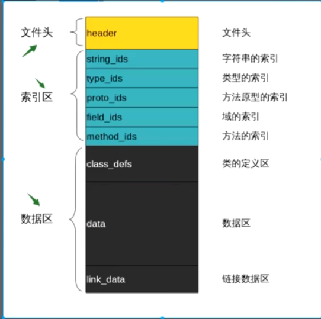

## .apk文件的组成

apk文件其实就是个压缩包，里面包含：

- classes.dex编译后的代码文件，安卓的可执行文件
- resource.arsc 编译后的资源文件（raw）
- AndroidManifest.xml 应用配置文件
- res文件夹 未编译的应用资源
- META-info文件夹 签名，包信息等

## 打包流程

1. aapt编译打包资源文件，生成`R.java`。
   1. 编译AndroidManifest成二进制；
   2. 编译layout等xml文件，生成`R.java`，和`resource.arsc`文件。
2. 处理aidl文件，生成对应的.java文件。
3. java编译器（javac）编译项目源码，生成.class文件，位于bin/classes目录下；
4. Android编译器使用dx工具整合所有的class文件生成`classes.dex`文件；
5. 由`apkbuilder`打包生成apk；
6. 对包签名；
7. 对齐处理，将包中的资源文件距离文件起始偏移为4字节的整数倍，这样通过内存映射访问apk文件时可提高速度，减少运行时内存的使用。

## 安装流程

核心类：`PMS`(PackageManagerService)

1. 复制apk到`data/app`目录下，解压并扫描安装包，把classes.dex文件保存到dalvik-cache目录，并再data/data目录下创建对应的应用数据目录；
2. 解析AndroidManifinest，提取信息写入`/data/system/packages.xml`；
3. Launcher加载桌面图标；

## APK安装方式

| 方式           | 有无界面 |
| -------------- | -------- |
| 系统应用       | 无       |
| market应用下载 | 无       |
| 第三方下载     | 有       |
| adb            | 无       |

## 反编译

### 流程

1. 解压.apk
2. 使用dex2jar将class.dex转为jar包
3. 使用jd-gui反编译jar包

### 加固手段

- 反模拟器
   模拟器运行apk，可以监控到各种行为，所以发现时模拟器在运行就直接退出。
- 代码虚拟化
   自建一个虚拟执行引擎，然后把原生的可执行代码转换成自定义的指令进行虚拟执行。
- 加密
   样本的部分可执行代码是以压缩或者加密的形式存在的，比如被保护过的代码被切割成多个小段，前面的一段代码先把后面的代码片段在内存中解密，然后再执行解密之后的代码。

### dex文件结构

