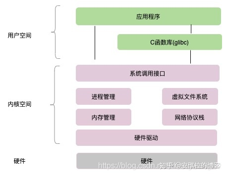
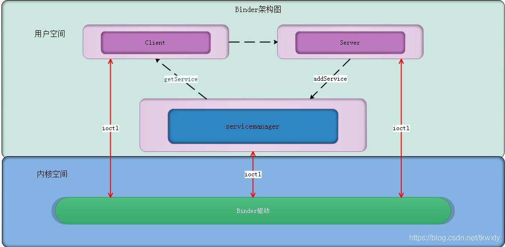
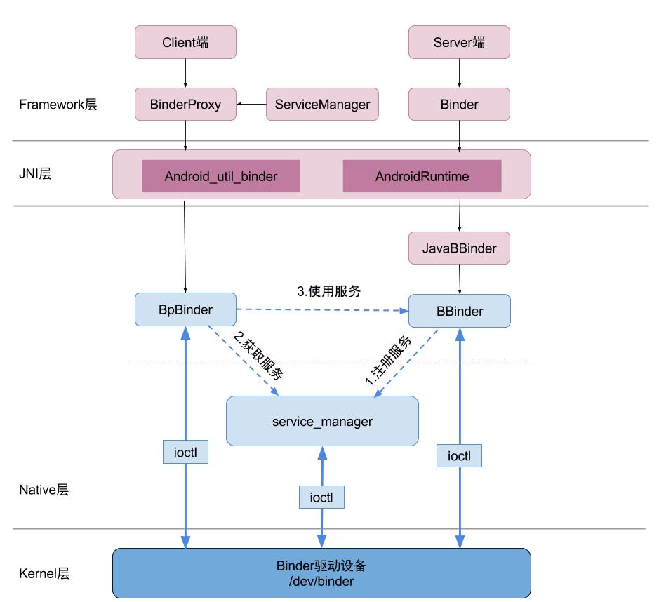

## Binder是什么

- 进程间通讯机制
- 系统驱动
- Binder.java跨进程能力

## 为何要多进程

- 申请更多内存
- 安全性隔离 

## Binder的优势

| 机制     | 性能     | 特点                   | 安全性                           |
| -------- | -------- | ---------------------- | -------------------------------- |
| Binder   | 一次拷贝 | CS架构易用             | 为每个App分配UID，支持实名和匿名 |
| 共享内存 | 零拷贝   | 控制复杂               | 差                               |
| socket   | 双拷贝   | CS架构，传输率低开销大 | 差                               |
| 信号量   | 双拷贝   | 缓存-转发              | 差                               |
| 管道     | 双拷贝   | 缓存-转发              | 差                               |

## 进程之间如何通讯

### 用户空间与内核空间



操作系统内部分为**用户空间与内核空间**。

从图中看，应用的进程处于用户空间，系统中同时存在多个应用相当于同时存在多个用户空间。而所有的用户空间都对应同一个内核空间。用户空间相互之间不共享，但是内核空间是共享的。

所有**系统资源**的管理都是在内核空间进行的，那我们应用程序需要访问磁盘，读取网卡的数据，新建一个线程都需要通过系统调用接口，完成从用户态到内存态的切换。

**当一个任务（进程）执行系统调用而陷入内核代码中执行时，称进程处于内核运行态（内核态）。**


>比如我们 Java 中需要新建一个线程，new Thread( Runnable ...) 之后调用 start() 方法时, 看Hotspot Linux 的JVM 源码实现，最终是调pthread_create 系统方法来创建的线程，这里会从用户态切换到内核态完成系统资源的分配，线程的创建。

那么不共享的用户空间之间怎么进行通信呢？传统的linux的IPC是使用**双拷贝**进行的，即不同用户空间中，不能简单的通过引用指针传递数据，而是必须在内核空间中调用`copy_from_user`先把数据拷贝到内核空间，再调用`copy_to_user`把数据拷贝到client所在的用户空间B。


## Binder通讯机制



这就很像我们在家里访问百度，我们先从浏览器输入百度的域名回车，然后请求会先到达附近的DNS，DNS负责把域名解析成对应的IP地址，然后转发请求到这个IP的服务器上。

- server，负责创建Binder实体，并且把Binder实体以名称的形式字注册到ServiceManager；
- ServiceManager，是一个独立的进程，提供Binder的注册和查询功能；`ServiceManager自己其实也是个server，自己带有一个特殊的Binder实体（0号），而其他进程都可以看作是client`。当我们的server创建Binder实体后，通过这个特殊的binder通信实现注册。而client也通过这个特殊的Binder，去查询目标Binder的名字，查到就返回Binder的引用。
- Binder驱动，真正的通信是由Binder驱动来完成的，提供了用户空间到内核空间切换（数据拷贝）线程管理，PID、UID管理等功能。

这里要注意的是，`SM位于用户空间，而BinderDriver位于内核空间`。

### BinderDriver的作用

主要是用来创建Binder实体，并且控制实体的访问，包括多线程对实体的访问安全，Client的访问权限，进程的中断等待等。

当有进程通过`BINDERSETCONTEXT_MGR `命令把自己注册成为ServiceManager时，会通过BinderDriver创建一个默认的Binder实体，并置于0号位，并且后面的新创建的Client都默认持有这个0号位的Binder实体（zygote不断fork自己，所以都带有0号位）。

### ServiceManager的宏观作用

SM是一个独立的**守护进程**，是Android系统中各个服务的管理者。系统中的所有server都通过名称-引用的方式在SM中注册，而client全都要通过SM查询服务名找到目标server之后再使用server提供的功能。

### Binder机制的宏观作用

从上面我们看SM的作用，就知道整个Binder机制的宏观作用，他就是Android系统的心脏，负责驱动Android系统的所有功能。

### Binder的通信过程



>ioctl函数是linux系统中驱动程序对外提供的调用接口。

#### 注册过程

1. Server进程启动之后，通过ioctl函数向Driver发起请求，并指明需要0号位binder引用对应的进程来处理；
2. 驱动收到请求后，通过SM内部的红黑树查询是否注册过binder实体，由于0号位已注册过了，就不需要再创建实体和添加引用了，直接把Binder实体转发给对应的进程，在这里就是SM进程；
3. SM收到请求之后，将Server的**binder引用**添加到内部的单链表中，完成注册；

#### 通信过程

1. client通过ioctl函数向Driver发起请求（包含binder名称）；
2. Driver将请求转发给SM；
3. SM在引用单链表中根据名称查询Server的引用；
4. 通过Driver返回Binder的引用；
5. Client收到引用之后，创建一个Server的代理；
6. Client调用代理的接口，通过Driver与真正的Server进行交互。

#### 总结

整个通信过程，其实就是创建远程代理与调用远程代理的过程。

## AIDL

### 定义

AIDL的全称是：Android接口定义语言(即 Android Interface Definition Language)，他定义的只不过是一套模板，实际起作用的是AS通过解释这个模板自动生成的`android.os.IInterface`的子类接口。作用是依靠`Service`中转，通过Binder机制来做IPC。

### 数据类型

AIDL支持的数据类型：

- byte
- char
- short
- int
- long
- float
- double
- boolean
- Parcelable
- List
- Map

### 定向Tag

```java
interface BookController {

    List<Book> getBookList();

    void addBookInOut(inout Book book);

    void addBookIn(in Book book);

    void addBookOut(out Book book);
}
```

- in 数据只能由客户端流向服务端
- out 数据只能由服务端流向客户端
- inout 数据可在服务端与客户端之间双向流通

如果AIDL方法接口的参数值类型是：基本数据类型、String、CharSequence或者其他AIDL文件定义的方法接口，那么这些参数值的定向 Tag 默认是且只能是 in，所以除了这些类型外，其他参数值都需要明确标注使用哪种定向Tag。

>引自https://www.jianshu.com/p/29999c1a93cd

### 源码

```java
//包名与项目包名一致
package com.vee.aidltest;

/**
*   自动生成的接口
**/
public interface IMyAidlInterface extends android.os.IInterface{

    /**
    *    我们自己声明的业务函数
    **/
    public java.lang.String getName() throws android.os.RemoteException;
  
    
    /**
    * 本接口的默认实现，其中业务方法`getName`返回null;
    **/
    public static class Default implements com.vee.aidltest.IMyAidlInterface{

        ...
    }


    /**
    *   静态内部类，继承自`android.os.Binder.Stub`类型，也遵循AIDL接口
    **/
    public static abstract class Stub extends android.os.Binder implements com.vee.aidltest.IMyAidlInterface{

        /**
        * 用来标记当前Binder，所以采用全类名表示
        **/
        private static final java.lang.String DESCRIPTOR = "com.vee.aidltest.IMyAidlInterface";
    
        /**
        *   构造方法中调用对象方法。
        **/
        public Stub(){
        this.attachInterface(this, DESCRIPTOR);
        }
        /**
        *  用于将服务端的Binder对象转换成客户端所需的AIDL接口类型的对象，这种转换过* 程是区分进程的，如果客户端和服务端位于同一进程，那么此方法返回的就是服务端*的Stub对象本身，否则返回的是系统封装后的Stub.proxy对象 
        */
        public static com.vee.aidltest.IMyAidlInterface asInterface(android.os.IBinder obj){
        if ((obj==null)) {
            return null;
        }
        android.os.IInterface iin = obj.queryLocalInterface(DESCRIPTOR);
        if (((iin!=null)&&(iin instanceof com.vee.aidltest.IMyAidlInterface))) {
            return ((com.vee.aidltest.IMyAidlInterface)iin);
        }
        return new com.vee.aidltest.IMyAidlInterface.Stub.Proxy(obj);
        }

        /**
        * 返回当前Binder对象
        **/
        @Override public android.os.IBinder asBinder(){
        return this;
        }

        @Override public boolean onTransact(int code, android.os.Parcel data, android.os.Parcel reply, int flags) throws android.os.RemoteException{
        java.lang.String descriptor = DESCRIPTOR;
        
        switch (code){
            case INTERFACE_TRANSACTION:
            {
            reply.writeString(descriptor);
            return true;
            }
            case TRANSACTION_getName:
            {
            data.enforceInterface(descriptor);
            java.lang.String _arg0;
            _arg0 = data.readString();
            java.lang.String _result = this.getName(_arg0);
            reply.writeNoException();
            reply.writeString(_result);
            return true;
            }
            default:
            {
            return super.onTransact(code, data, reply, flags);
            }
        }
        }

        /**
        *   自动生成的静态代理，在客户端回调
        **/
        private static class Proxy implements com.vee.aidltest.IMyAidlInterface{
        private android.os.IBinder mRemote;
        Proxy(android.os.IBinder remote){
            mRemote = remote;
        }
        @Override public android.os.IBinder asBinder(){
            return mRemote;
        }
        public java.lang.String getInterfaceDescriptor(){
            return DESCRIPTOR;
        }

        @Override public java.lang.String getName() throws android.os.RemoteException
        {
            android.os.Parcel _data = android.os.Parcel.obtain();
            android.os.Parcel _reply = android.os.Parcel.obtain();
            java.lang.String _result;
            try {
            _data.writeInterfaceToken(DESCRIPTOR);
            boolean _status = mRemote.transact(Stub.TRANSACTION_getName, _data, _reply, 0);
            if (!_status && getDefaultImpl() != null) {
                return getDefaultImpl().getName();
            }
            _reply.readException();
            _result = _reply.readString();
            }
            finally {
            _reply.recycle();
            _data.recycle();
            }
            return _result;
        }
        public static com.vee.aidltest.IMyAidlInterface sDefaultImpl;
        }
    
        /**
        *   用来标记我们自己定义的方法，前缀确定
        **/
        static final int TRANSACTION_getName = (android.os.IBinderFIRST_CALL_TRANSACTION + 0);
        

        /**
        * 当处于客户端时调用，这里就是生成代理
        **/
        public static boolean setDefaultImpl(com.vee.aidltest.IMyAidlInterface impl) {
        if (Stub.Proxy.sDefaultImpl != null) {
            throw new IllegalStateException("setDefaultImpl() called twice");
        }
        if (impl != null) {
            Stub.Proxy.sDefaultImpl = impl;
            return true;
        }
        return false;
        }

        /**
        *   当处于客户端时用来获取代理对象
        **/
        public static com.vee.aidltest.IMyAidlInterface getDefaultImpl() {
        return Stub.Proxy.sDefaultImpl;
        }
}
```

#### DESCRIPTOR

Binder的唯一标识，一般用当前Binder的类名表示，比如本例中的`com.ryg.chapter_2.aidl.IBookManager`。

#### asInterface(android.os.IBinder obj)

用于将服务端的Binder对象转换成客户端所需的AIDL接口类型的对象，这种转换过程是区分进程的，如果客户端和服务端位于同一进程，那么此方法返回的就是服务端的Stub对象本身，否则返回的是系统封装后的Stub.proxy对象。

#### asBinder

此方法用于返回当前Binder对象。

#### onTransact:重要

这个方法运行在服务端中的Binder线程池中，当客户端发起跨进程请求时，远程请求会通过系统底层封装后交由此方法来处理。该方法的原型为`public Boolean onTransact(int code,android.os.Parcel data,android.os.Parcel reply,int flags)`。服务端先通过switch(code)可以判断出客户端所请求的是具体哪个方法。还记得这个方法标记吗：

```java
/**
*   用来标记我们自己定义的方法，前缀确定
**/
static final int TRANSACTION_getName = (android.os.IBinderFIRST_CALL_TRANSACTION + 0);
```

接着从data中取出目标方法所需的参数（如果目标方法有参数的话），data是个Parcel，所以这里是从二进制流中去读。

然后执行目标方法。当目标方法执行完毕后，就向reply中写入返回值（如果目标方法有返回值的话），而有异常的话也会写进reply。reply也是个Parcel，所以这里是把数据写进了流。

onTransact方法的执行过程就是这样的。需要注意的是，如果此方法返回false，那么客户端的请求会失败，因此我们可以利用这个特性来做权限验证，毕竟我们也不希望随便一个进程都能远程调用我们的服务。

#### Proxy.getName

这个方法运行在客户端。

首先从Parcel的缓存池中拿到两个parcel对象分别是`_data`和`_reply`，然后把参数`name`写进`_data`，

然后调用`mRemote`对象的`transact()`方法发起RPC请求，同时挂起当前线程。

这里调用`transact()`时传递了`Stub.TRANSACTION_getName`，RPC到服务端时也是依靠方法ID去调用方法的。

然后服务端的`transact`方法会回调，知道RPC过程结束返回后，当前线程继续执行，并从_reply中读取服务端`transact`方法的返回值或者异常。

最后先回收刚刚拿到的Parcel，然后返回`_result`给客户端。

这里的`mRemote`是个`IBinder`类型，但是后者其实是`Binder`的接口，那么可以断定`mRemote`其实就是个`Binder`。

## 提取一下重点

两个端：

- server
- client

两个标记：

- DESCRIPTOR：当前Binder的唯一标志
- TRANSACTION_getName：方法的唯一标志

两个类型：

- abstract class `Stub` extends android.os.Binder implements IMyAidlInterface
- static class `Proxy` implements IMyAidlInterface

5个方法：

- asInterface
- asBinder
- 业务方法
- transact
- onTransact

## 梳理流程


1. 服务端向`ServiceManager`注册Binder。
2. 客户端(通过`bindService()`回调)拿到Binder，调用`Stub.asInterface(binderObj)`。在这个方法中通过`DESCRIPTOR`标志在`ServiceManager`中去找Binder，如果找到直接返回，找不到就创建这个binder的Proxy对象。Proxy对象中包含被代理的业务方法。
3. 客户端调用Proxy中代理的业务方法，此时创建两个Parcel：`_data`和`_reply`。然后调用代理中的binder的`transact()`方法，传入`TRANSACTION_getName`方法标记、_data、_reply，这样就执行了服务端binder中的业务逻辑方法，此时线程挂起。
4. 客户端调用服务端的`transact()`方法会回调服务端的`onTransact()`方法。在这个方法中会根据`TRANSACTION_getName`判断应该调用哪个业务逻辑方法，然后挂起线程，执行对应的业务逻辑方法，最后在reply中写入异常或结果。
5. 客户端继续执行`transact()`方法，从_reply中读取异常或返回值，再继续线程，最后回收_data和_reply并返回_reply中读到的结果。

## Binder连接池

