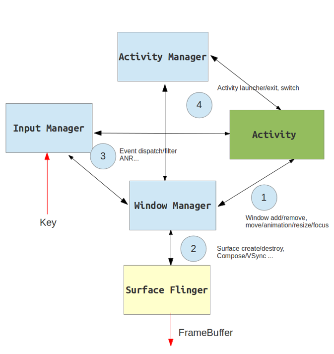

<!--more-->

### 概述

ActivityManagerService诞生自SystemServer，主要负责四大组件的启动、切换、调度以及应用进程的管理和调度工作。

主要分为:

* 服务代理：由ActivityManagerProxy实现，用于与Server端提供的系统服务进行IPC；
* 服务中枢：ActivityManagerNative继承自Binder并实现IActivityManager，它提供了服务接口和Binder接口的相互转化功能，并在内部存储服务代理对像，并提供了getDefault方法返回服务代理；
* Client：由ActivityManager封装一部分服务接口供Client调用。ActivityManager内部通过调用ActivityManagerNative的getDefault方法，可以得到一ActivityManagerProxy对像的引用，进而通过该代理对像调用远程服务的方法；
* Server: 由ActivityManagerService实现，提供Server端的系统服务。

实际上他就是个Binder,可以用来IPC

### Hook点

binder天然带有调用者的身份信息uid和进程信息pid 。

