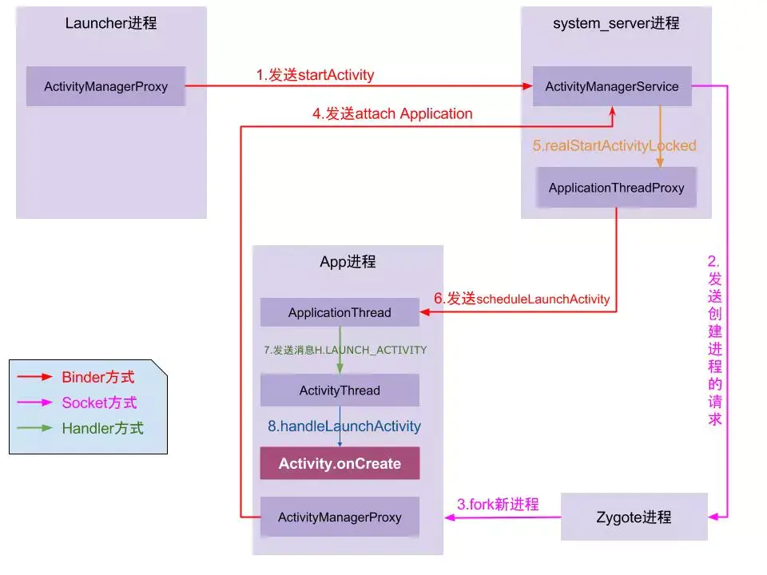

<!--more-->

### 流程图

1. 点击桌面App图标，Launcher通过`Binder`对`AMS`发起startActivity请求；
2. AMS接收到请求后，通过`Socket`向`zygote`进程发送创建进程的请求；
3. Zygote进程fork自己搞出App进程；
4. App进程，通过`Binder`向`AMS`发起`attachApplication`请求；
5. AMS收到请求后，进行一系列准备工作后，通过binder向App进程发送scheduleLaunchActivity请求；
6. App进程的`ApplicationThread`收到请求后，通过`handler`向`ActivityThread`发送LAUNCH_ACTIVITY消息；
7. ActivityThread收到消息后，通过反射机制创建目标Activity，并回调Activity的`onCreate()`等生命周期方法。
8. 当`onResume`执行完毕后UI开始渲染，渲染完毕后，App正式启动完毕。

