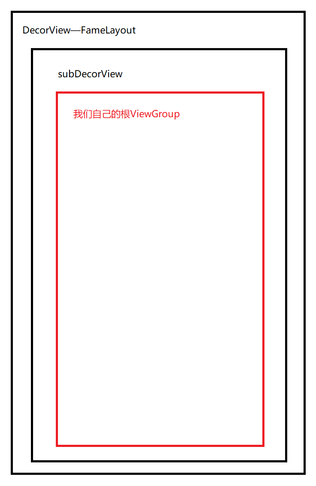

## Window

Activity、Window、DecorView三者一一对应。

### Window的分类

1. 普通window，z轴范围1~99；
2. 子window，z轴范围1000~1999，需要依附在父window中，比如dialog；
3. 系统window，z轴范围2000~29999，比如状态栏、toast、键盘等。

## setContentView方法

这里直接看Android30版本，AndroidX包下的activity:

```java
public class AppCompatActivity extends FragmentActivity implements AppCompatCallback,
        TaskStackBuilder.SupportParentable, ActionBarDrawerToggle.DelegateProvider {

@Override
public void setContentView(@LayoutRes int layoutResID) {
    getDelegate().setContentView(layoutResID);
}
```

我们的Activity重写了AppCompatActivity的`onCreate`方法，并且直接调用了父级的`setContentView`方法，这个方法有三个重载：

```java
@Override
public void setContentView(View view) {
    getDelegate().setContentView(view);
}
```

重点要看一下这个`getDelegate()`方法：

```java
//单例创建
@NonNull
public AppCompatDelegate getDelegate() {
    if (mDelegate == null) {
        mDelegate = AppCompatDelegate.create(this, this);
    }
    return mDelegate;
}

@NonNull
public static AppCompatDelegate create(@NonNull Activity activity,
        @Nullable AppCompatCallback callback) {
    return new AppCompatDelegateImpl(activity, callback);
}
```

每一个Activity对象都持有一个单例的代理对象，setContent其实是由它来完成的。为什么要搞个代理呢？因为不同版本的系统，使用了不同包名下的Activity。

接下来看`AppCompatDelegateImpl`：

```java
@Override
public void setContentView(View v) {
    //确保存在decor
    ensureSubDecor();
    //找到decorView中id为container容器
    ViewGroup contentParent = mSubDecor.findViewById(android.R.id.content);
    //清空所有view
    contentParent.removeAllViews();
    //把我们传递的view附加上去
    contentParent.addView(v);
    //回调
    mAppCompatWindowCallback.getWrapped().onContentChanged();
}
```

### 创建SubDecorView

在这里可以看出来，每个Activity中都存在一个`SubDecorView`，并且SubDecorView中存在一个id为'android.R.id.content'的ViewGroup。

继续看它是怎么确保SubDecor的：

```java
private void ensureSubDecor() {
    if (!mSubDecorInstalled) {

        //根据标志位判断，按需创建Decor
        mSubDecor = createSubDecor();

        ...
    }
}

private ViewGroup createSubDecor() {
    ...

    // 重点是这里，确保window的存在
    ensureWindow();
    mWindow.getDecorView();

    //根据风格主题从对应的模板填充SubDecorView
    if (!mWindowNoTitle) {
        if (mIsFloating) {
            subDecor = (ViewGroup) inflater.inflate(
                    R.layout.abc_dialog_title_material, null);
            ...
        } else if (mHasActionBar) {
            ...
            subDecor = (ViewGroup) LayoutInflater.from(themedContext)
                    .inflate(R.layout.abc_screen_toolbar, null);
            ...
        }
    } else {
        if (mOverlayActionMode) {
            subDecor = (ViewGroup) inflater.inflate(
                    R.layout.abc_screen_simple_overlay_action_mode, null);
        } else {
            subDecor = (ViewGroup) inflater.inflate(R.layout.abc_screen_simple, null);
        }
    }

    mWindow.setContentView(subDecor);
    ...
}
```

#### ensureWindow确保Window附加

在`AppCompatDelegateImpl`中，在setContentView的时候，会先检查是否存在DecorView，然后按需创建Decor，在创建Decor的时候又去检查是否持有window，然后按需附加Window。

```java
private void ensureWindow() {
    if (mWindow == null && mHost instanceof Activity) {
        attachToWindow(((Activity) mHost).getWindow());
    }
}

private void attachToWindow(@NonNull Window window) {
    ...
    mWindow = window;
}
```

我追踪`(Activity) mHost).getWindow()`，发现在setContentView时，window对象已经被创建好了，那么Window是何时创建的呢？

```java
public Window getWindow() {
    return mWindow;
}

@UnsupportedAppUsage
final void attach(Context context, ActivityThread aThread,
        Instrumentation instr, IBinder token, int ident,
        Application application, Intent intent, ActivityInfo info,
        CharSequence title, Activity parent, String id,
        NonConfigurationInstances lastNonConfigurationInstances,
        Configuration config, String referrer, IVoiceInteractor voiceInteractor,
        Window window, ActivityConfigCallback activityConfigCallback, IBinder assistToken) {
    
    ...
    mWindow = new PhoneWindow(this, window, activityConfigCallback);
    ...
}
```

window是Activity在`attach`的时候创建的，window本身是个接口，它的实现类是`PhoneWindow`。

#### mWindow.getDecorView()

继续前面的代码往下走，就遇到了这一句。我们已经知道了，这里的window其实就是phoneWindow，然后进入PhoneWindow.java文件中搜索`getDecorView()`方法：

```java
@Override
public final @NonNull View getDecorView() {
    if (mDecor == null || mForceDecorInstall) {
        installDecor();
    }
    return mDecor;
}

//创建和配置DecorView
private void installDecor() {
    mForceDecorInstall = false;
    if (mDecor == null) {
        //创建DecorView
        mDecor = generateDecor(-1);
        ...
    } else {
        mDecor.setWindow(this);
    }
    ...
}

protected DecorView generateDecor(int featureId) {
    ...
    return new DecorView(context, featureId, this, getAttributes());
}
```

然后看这个所谓DecorView到底是个啥：

```java
public class DecorView extends FrameLayout implements RootViewSurfaceTaker, WindowCallbacks {
    private static final String TAG = "DecorView";

    private static final boolean DEBUG_MEASURE = false;

```

噔噔噔噔，果然就是个FrameLayout！

### phoneWiodow.setContentView(resId)

然后就是调用了phoneWindow的`setContentView(subDecor)`方法，这个设计模式很明显是个装饰者模式：

```java
@Override
public void setContentView(int layoutResID) {
    if (mContentParent == null) {
        //检查机制，确保DeecorView一定存在
        installDecor();
    } else if (!hasFeature(FEATURE_CONTENT_TRANSITIONS)) {
        mContentParent.removeAllViews();
    }

    if (hasFeature(FEATURE_CONTENT_TRANSITIONS)) {
        //播放跳转动画
        final Scene newScene = Scene.getSceneForLayout(mContentParent, layoutResID,
                getContext());
        transitionTo(newScene);
    } else {
      
        mLayoutInflater.inflate(layoutResID, mContentParent);
    }
    ...
}
```
### 当前的View层级




         