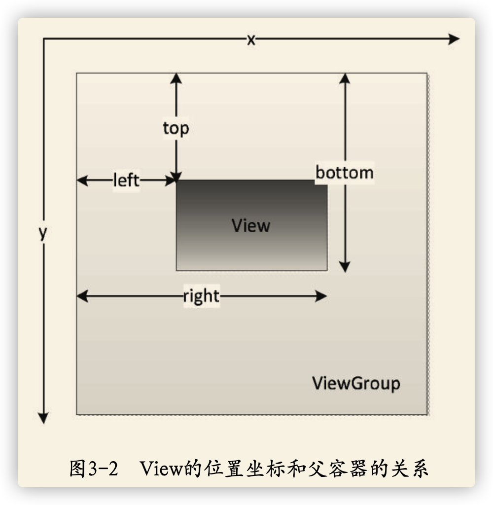

## 位置参数

### 主要位置参数



View的位置主要由它的四个顶点(相对父容器)来决定：

- getLeft()
- getTop()
- getRight()
- getBottom()

### 用于移动的参数

- x/y View左上角相对父容器的坐标；
- translationX/translationY View左上角相对父容器的偏移量。

x = left + translationX;
y = top + translationY;

在View移动中，top和left不会变，xy,translation系列会变。

## 用户交互

### MotionEvent

事件：

- ACTION_DOWN
- ACTION_MOVE
- ACTION_UP

触发点：

- getX/getY 相对当前View左上角的x和y坐标；
- getRawX/getRawY 相对于手机屏幕左上角的x和y坐标。

### TouchSlop

系统能识别出的滑动最小距离。是个常量。

```java
ViewConfiguration. get(getContext()).getScaledTouchSlop()
```

可以利用这个常量来做过滤。

### VelocityTracker

速度追踪，用于追踪手指在一定时间内滑动过的像素数。

```java
VelocityTracker velocityTracker = VelocityTracker.obtain();
velocityTracker.addMovement(event);

//事件定位1000毫秒，也就是1秒
velocityTracker.computeCurrentVelocity(1000);

int xVelocity = (int) velocityTracker.getXVelocity();
int yVelocity = (int) velocityTracker.getYVelocity();

//回收
velocityTracker.clear();
velocityTracker.recycle();
```

### GestureDetector

手势检测，用于辅助检测用户的单击、滑动、长按、双击等行为。

```java
GestureDetector  mGestureDetector = new GestureDetector(this);
//解决长按屏幕后无法拖动的现象
mGestureDetector.setIsLongpressEnabled(false)
```

然后在View的`onTouchEvent(event)`方法中接管事件：

```java
boolean consume = mGestureDetector.onTouchEvent(event);
return consume;
```

然后实现`OnGestureListener`和`OnDoubleTapListener`方法。

### Scroller

在View滑动时，可以调用scrollTo/scrollBy方法，但是这两个方法会瞬间完成，没有过度动画，Scroller可解决这个问题。

```java
Scroller scroller = new Scroller(mContext);
// 缓慢滚动到指定位置
private void smoothScrollTo(int destX,int destY) {
    int scrollX = getScrollX();
    int delta = destX -scrollX;
    // 1000ms内滑向destX，效果就是慢慢滑动
    mScroller.startScroll(scrollX,0,delta,0,1000);
    invalidate();
}
@Override
public void computeScroll() {
    if (mScroller.computeScrollOffset()) {
            scrollTo(mScroller.getCurrX(),mScroller.getCurrY());
            postInvalidate();
    }
}
```

### View的滑动

- scrollTo/scrollBy 使内容滑动
- 动画实现平移效果
- 改变View的LayoutParams使View重新布局。

#### scrollTo/scrollBy

- scrollTo  绝对滑动。
- scrollBy 基于当前位置相对滑动。

scrollBy实际上也是调用scrollTo方法实现的。

获取当前滑动位置：

- getScrollX
- getScrollY 

在滑动过程中，mScrollX的值总是等于View左边元和View内容左边元在水平方向的距离。而mScrollY的值总是等于View上边缘和内容上边缘在竖直方向的距离。

**scrollTo和scrollBy只改变View内容的位置**。

#### 动画操作translationX/translationY

View动画是对view的影像做操作，并不能真正改变View的位置参数。所以在新的位置单击等操作会无效。解决方式是使用属性动画。

#### 改布局参数

```java
MarginLayoutParams params = (MarginLayoutParams)mButton1.getLayoutParams();
params.width += 100;
params.leftMargin += 100;
mButton1.requestLayout();
//或者mButton1.setLayoutParams(params);
```

## 事件分发机制

### 点击事件的传递规则

- dispatchTouchEvent
- onInterceptTouchEvent
- onTouchEvent

`dispatchTouchEvent`用来用来做事件的分发，返回结果受当前View的`onTouchEvent`和下级View的`dispatchTouchEvent`影像。返回值表示是否小号掉当前的事件。

`onInterceptTouchEvent`用来判断是否拦截某个事件，如果当前View拦截了某个事件，那么在同一个事件序列中，此方法不会被再次调用，返回结果表示是否拦截当前事件。

`onTouchEvent`在`dispatchTouchEvent`方法中调用，用来处理点击事件，返回结果表示是否消耗当前事件，如果不消耗，则在同一个事件序列中，当前View无法再次接收到事件。

```java
public boolean dispatchTouchEvent(MotionEvent ev) {
    boolean consume = false;
    if (onInterceptTouchEvent(ev)) {
        //如果拦截到，调用onTouchEvent
        consume = onTouchEvent(ev);
    } else {
        // 如果不拦截，透传到子View的dispatchTouchEvent
        consume = child.dispatchTouchEvent(ev);
    }
    return consume;
}
```

在这里可以看出，子View是事件的最终处理者，所以不需要在子View内进行拦截了，因而在自定义View中不需要重写`onInterceptTouchEvent`。

当一个View设置了`onTouchListener`，事件先被`onTouchListener`处理，其中的`onTouch()`方法先被回调，如果返回false，则当前View的`onTouchEvent`方法才会被调用；如果返回true，`onTouchEvent()`方法就不会被调用。在`onTouchEvent()`方法中，如果当前View设置了`onClickListener`，那么最后才会调用`onClick()`方法。`onClickListener`的优先级最低，处于事件传递的尾端。

### 事件传递的层级顺序

1. Activity
2. Window
3. ViewGroup
4. View

事件从上倒下传递，如果其中一环的`onTouchEvent`返回false，则回传到父容器的`onTouchEvent`方法。如果所有的View都不处理事件，最终将会回传给Activity的`onTouchEvent()`方法处理。

`MotionEvent`代表一系列事件，基本上会被一个View统一处理，也可以在通过调用其他View的`onTouchEvent`处理。

如果View一旦开始处理事件，如果它不消耗掉当前事件，那么同一事件序列中的其他事件都不会再交给他处理，eg:View收到了ACTION_DOWN，如果不消耗掉，那么后面的ACTION_MOVE和ACTION_UP都不会再交给他处理。

如果View不消耗掉除了ACTION_DOWN以外的其他事件，那么这个点击事件就会消失，父级容器的`onTouchEvent()`并不会调用。并且当前View可以持续收到后续的事件，最终这些消失的点击事件会传递给Activity处理。

ViewGroup默认不拦截任何事件。`onInterceptTouchEvent()`方法默认返回false。

View的`onTouchEvent`默认返回true，即默认消耗事件（除非不可点击）。

View的`enable`属性不影像`onTouchEvent`的默认返回值。

### 滑动冲突

#### 内外滑动方向不一致

在外层根据滑动方向判断，如果与自己方向一致，就拦截，否则传递给子View处理并消耗掉。

判断方法：

- 水平方向与竖直方向的夹角；
- 水平方向与竖直方向的距离差

#### 内外滑动方向一致

- 根据业务需求来做判断
- 根据ACTION_DOWN的落点坐标来判断

## requestDisallowInterceptTouchEvent