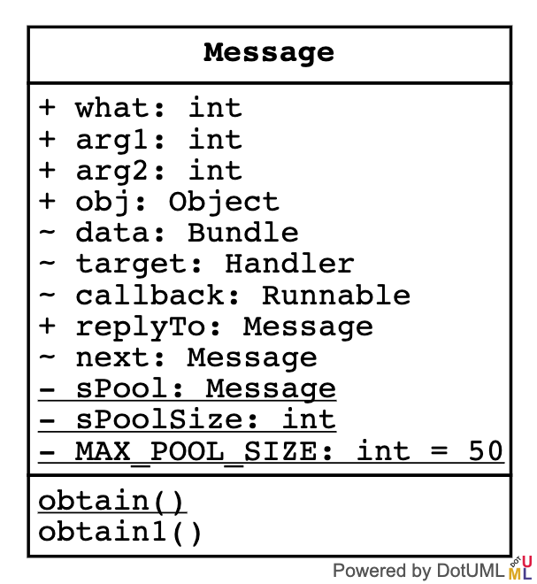

### 创建

我们都知道创建Message的时候有两种方式：

- 构造方法创建（不推荐）。
- `Message.obtain();`（推荐）.

为了防止OOM，我们一般都是直接用第二种方式，直接从回收池里面拿闲置。那么这个闲置的Message是从哪创建的呢？为什么我们不用先new一个Message，回收池里面就有呢？

```java

public static final Object sPoolSync = new Object();
/**
 * 池子
 * /
private static Message sPool;
private static int sPoolSize = 0;
private static final int MAX_POOL_SIZE = 50;

@UnsupportedAppUsage
/*package*/ Message next;

public static Message obtain() {
    synchronized (sPoolSync) {
        if (sPool != null) {
            Message m = sPool;
            sPool = m.next;
            m.next = null;//打断了链条
            m.flags = 0; // clear in-use flag
            sPoolSize--;
            return m;
        }
    }
    return new Message();
}
```

由上面代码可以看出，`obtain()`方法检查池子为null,就会自动`new`一个message出来。而如果不为空，则抽取出来清一下状态返回，并把原来的`next`前置给`sPool`，最后把`size`自减1。

这里的`sPoll`比较有意思，叫池子，但其实是个单向链，我觉得叫队列更合适。但是看到后面会发现还是应该叫池子。


所以，**`Message`的实质是单向链+Size整数，最多不能超过50个！**

### 回收复用指定的Message

```java
/**
 * Same as {@link #obtain()}, but copies the values of an existing
 * message (including its target) into the new one.
 * @param orig Original message to copy.
 * @return A Message object from the global pool.
 */
public static Message obtain(Message orig) {
    Message m = obtain();
    m.what = orig.what;
    m.arg1 = orig.arg1;
    m.arg2 = orig.arg2;
    m.obj = orig.obj;
    m.replyTo = orig.replyTo;
    m.sendingUid = orig.sendingUid;
    m.workSourceUid = orig.workSourceUid;
    if (orig.data != null) {
        m.data = new Bundle(orig.data);
    }
    m.target = orig.target;
    m.callback = orig.callback;

    return m;
}
```

如果需要回收并且复用指定的Message，那么就把该message传递到obtain方法中。在方法内部，其实是通过copy值给回收的message来完成。

### target

`obtain`方法可以传递一个Handler对象。

```java
/**
* Same as {@link #obtain()}, but sets the value for the <em>target</em> member on the Message returned.
* @param h  Handler to assign to the returned Message object's <em>target</em> member.
* @return A Message object from the global pool.
*/
public static Message obtain(Handler h) {
    Message m = obtain();
    m.target = h;

    return m;
}
```

如果指定了对象，就可以通过`sendToTarget()`方法直接发送Message了。

### callback

```java
/**
     * Same as {@link #obtain(Handler)}, but assigns a callback Runnable on
     * the Message that is returned.
     * @param h  Handler to assign to the returned Message object's <em>target</em> member.
     * @param callback Runnable that will execute when the message is handled.
     * @return A Message object from the global pool.
     */
    public static Message obtain(Handler h, Runnable callback) {
        Message m = obtain();
        m.target = h;
        m.callback = callback;
        return m;
    }
```

`obtain`方法还可以传递一个`Runnable`，作用是当message发送到Handler时就会执行这个`runnable`。而且这个**callback竟然与Handler在同一线程中！！！**

但是一旦给消息设置了`callback`，实测Handler的`handleMessage`会失效，这是为啥，要想一想了。

### 传递

- `mHandler.send(msg);`
- `msg.sendToTarget();`
- Parcelable

### 异步

设置消息是否异步，这意味着它不受{@link Looper}同步障碍的约束。

```java
public void setAsynchronous(boolean async) {
    if (async) {
        flags |= FLAG_ASYNCHRONOUS;
    } else {
        flags &= ~FLAG_ASYNCHRONOUS;
    }
}
```

异步方式我平时很少使用，听说是可以提升消息的重要性，如果标明异步，那么MessageQueue将会由近及远优先处理异步消息，然后再处理同步消息。

### 回收

```java
public void recycle() {
    if (isInUse()) {
        if (gCheckRecycle) {
            throw new IllegalStateException("This message cannot be recycled because it is still in use.");
        }
        return;
    }
    recycleUnchecked();
}
```

先检测是否在使用中，检测通过才真正的回收：

```java
/**
 * 回收一个可能正在使用中的Message。
 *   当队列中的Message被释放时，由MessageQueue 和 Looper在内部调用此方法。
 */
@UnsupportedAppUsage
void recycleUnchecked() {
    // Mark the message as in use while it remains in the recycled object pool.
    // Clear out all other details.
    flags = FLAG_IN_USE;
    what = 0;
    arg1 = 0;
    arg2 = 0;
    obj = null;
    replyTo = null;
    sendingUid = UID_NONE;
    workSourceUid = UID_NONE;
    when = 0;
    target = null;
    callback = null;
    data = null;

    synchronized (sPoolSync) {
        if (sPoolSize < MAX_POOL_SIZE) {
            next = sPool; // 添加入链条
            sPool = this;
            sPoolSize++;
        }
    }
}
```

这个方法的作用是把当前的Message对象回滚到初始状态，并且标记为「正在使用」。把当前的Message赋值给了`next`，并且`sPoolSize++`,表示多了个闲置。

`MAX_POOL_SIZE`常量的值为50，那么就是**一个App最多能有50个闲置的message**。

### 总结

`Message`的原理是**整数sPoolSize+静态单向链sPoll**，平时我们使用的message都是从`sPoll`中取**队首**，状态改为闲置，回收后把状态改成「使用中」，并插回到**队首**，遵循「后进先出」原则，并在**填充**和**回收**时通过`synchronized`保障线程安全。
