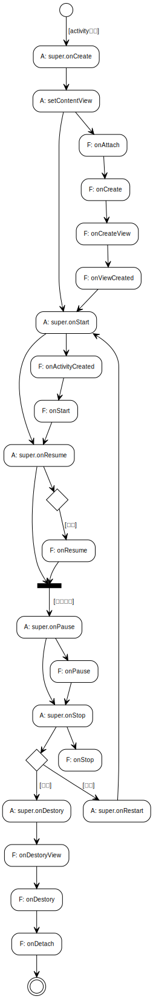

## 记忆方式

Fragment的`onAttach`,`onCreate`,`onCreateView`,`onViewCreated`在附加到Activity时执行，如`setContentView`或者`add`,`replace`时。

Fragment的`onResume`是在Activity的`onResume`执行完之后才会执行，而其他生命周期都在Activity的`super.onXXX`内执行。

跳转时，前一个页面的生命周期走到`onPause`时暂停，等待后一个页面的生命周期走到`onResume`之后，再继续执行`onStop`；同理，返回时后一个页面走到`onPause`时暂停，前一个页面`onRestart`,`onStart`,`onResume`之后，再继续执行剩下的`onStop`,`onDestory`。

## 懒加载

Fragment的懒加载主要是用于`ViewPager`中，ViewPager会在加载fragment之前调用其`setUserVisibleHint()`方法。所以`setUserVisibleHint()`是在`onActtch()`方法之前调用。

## 流程图



## 启动

```log
D: FirstActivity's super.onCreate: 前
D: FirstActivity's super.onCreate: 后
D: FirstActivity's setContentView: 前

D: FirstFragment's onAttach: 
D: FirstFragment's onCreate: 
D: FirstFragment's onCreateView: 
D: FirstFragment's onViewCreated: 

D: FirstActivity's setContentView: 后
D: FirstActivity's super.onStart: 前

D: FirstFragment's onActivityCreated: 
D: FirstFragment's onStart: 

D: FirstActivity's super.onStart: 后
D: FirstActivity's super.onResume: 前
D: FirstActivity's super.onResume: 后
D: FirstFragment's onResume: 
```

fragment的`onAttach`，`onCreate`，`onCreateView`，`onViewCreated`是在Activity的`setContentView`中执行的。

想一下就知道，Activity的`setContentView`的目的是从xml中加载View，而我把fragment写在了xml里面。

>这里有个小插曲，事实证明，Activity的`super.onCreate`可以写在`setContentView`之后，但是xml中存在fragment时就会报错。

fragment的`onActivityCreated`、`onStart`是在Activity的`super.onStart`方法中执行。

fragment的`onResume`是在activity的`super.onResume`之后执行。

## 跳转

```log
D: FirstActivity's super.onPause: 前
D: FirstFragment's onPause: 
D: FirstActivity's super.onPause: 后

D: SecondActivity's super.onCreate: 前
D: SecondActivity's super.onCreate: 后
D: SecondActivity's setContentView: 前
D: SecondFragment's onAttach: 
D: SecondFragment's onCreate: 
D: SecondFragment's onCreateView: 
D: SecondFragment's onViewCreated: 
D: SecondActivity's setContentView: 后
D: SecondActivity's super.onStart: 前
D: SecondFragment's onActivityCreated: 
D: SecondFragment's onStart: 
D: SecondActivity's super.onStart: 后
D: SecondActivity's super.onResume: 前
D: SecondActivity's super.onResume: 后
D: SecondFragment's onResume: 

D: FirstActivity's super.onStop: 前
D: FirstFragment's onStop: 
D: FirstActivity's super.onStop: 后
```

fragment的`onPause`是在Activity的`super.onPause`中执行。

当第二个含有fragment的Activity可见后，上一个Activity的生命周期才会继续。

然后上一个fragment的`onStop`在Activity的`onStop`中执行。

**注意**，前一个Activity执行到`onPause`，然后第二个Activity生命周期完成后，前一个Activity才会执行`onStop`。

### 返回

```log
D: SecondActivity's super.onPause: 前
D: SecondFragment's onPause: 
D: SecondActivity's super.onPause: 后

D: FirstActivity's super.onRestart: 前
D: FirstActivity's super.onRestart: 后

D: FirstActivity's super.onStart: 前
D: FirstFragment's onStart: 
D: FirstActivity's super.onStart: 后
D: FirstActivity's super.onResume: 前
D: FirstActivity's super.onResume: 后
D: FirstFragment's onResume: 

D: SecondActivity's super.onStop: 前
D: SecondFragment's onStop: 
D: SecondActivity's super.onStop: 后

D: SecondActivity's super.onDestroy: 前
D: SecondFragment's onDestroyView: 
D: SecondFragment's onDestroy: 
D: SecondFragment's onDetach: 
D: SecondActivity's super.onDestroy: 后

```

先执行第二个Activity的`onPause`。

再回调前一个Activity的`onRestart`。

fragment的`onStart`在Activity的`super.onStart`中执行。

fragment的`onResume`在Activity的`super.onResume`中执行。

fragment的`onStop`在Activity的`super.onStop`中执行。

fragment的`onDestroyView`、`onDestroy`、`onDetach`在Activity的`super.onDestroy`中执行。

**注意**fragment的`onResume`是在Activity的`onResume`之后执行的！！！

## 退入后台

```log
D: FirstActivity's super.onPause: 前
D: FirstFragment's onPause: 
D: FirstActivity's super.onPause: 后
D: FirstActivity's super.onStop: 前
D: FirstFragment's onStop: 
D: FirstActivity's super.onStop: 后
```

## 回到前台

```log
D: FirstActivity's super.onRestart: 前
D: FirstActivity's super.onRestart: 后
D: FirstActivity's super.onStart: 前
D: FirstFragment's onStart: 
D: FirstActivity's super.onStart: 后
D: FirstActivity's super.onResume: 前
D: FirstActivity's super.onResume: 后
D: FirstFragment's onResume: 
```

## 退出

```log
D: FirstActivity's super.onPause: 前
D: FirstFragment's onPause: 
D: FirstActivity's super.onPause: 后

D: FirstActivity's super.onStop: 前
D: FirstFragment's onStop: 
D: FirstActivity's super.onStop: 后

D: FirstActivity's super.onDestroy: 前
D: FirstFragment's onDestroyView: 
D: FirstFragment's onDestroy: 
D: FirstFragment's onDetach: 
D: FirstActivity's super.onDestroy: 后
```
