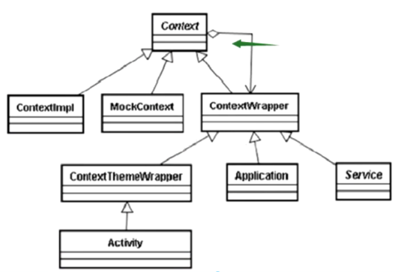

## 字节流

标准用法：

```java
DataOutputStream out = new DataOutputStream(//负责数据类型
    new BufferedOutputStream(//添加缓冲区，提高读流效率
        new FileOutputStream(//负责把文件转成流
            new File(file)
        )
    )
);

//DataOutputStream类型可直接读写一般类型变量
out.writeString("哈哈");

// 在读取时，比如与写入时顺序一样，才能成功读出来
```

以上代码充分体现了**装饰者**模式。

装饰模式在Android中的体现:



## 字符流

最大的区别：`readLine()`

字符流自带编码。

```java
InputStreamReader isr = new InputStreamReader(in);
BufferedReader br = new BufferedReader(isr);
String line;
while ((line = br.readLine()) != null) {
    System.out.println(line);
}
br.close();
```

## 字符流与字节流的依赖关系

字符流->字节流->文件

## RadomAccessFile（用于断点续传）

- File 打哪指哪
- RadomAccessFile 指哪打哪

主要是靠seek()方法标记磁头位置。

## NIO——FileChannel

大文件操作时使用。

## Android各版本对文件系统的变更

| 版本号 | 修改内容                                                                                                                         |
| ------ | -------------------------------------------------------------------------------------------------------------------------------- |
| 4.4    | 访问外部公共文件getExternalStoragePublicDirectory()需要具备READ_EXTERNAL_STORAGE权限。                                           |
| 7.0    | 获取本地文件的Uri方式由Uri.fromFile(new File(filePath))改为FileProvider.getUriForFile()。并且需要在AndroidManifest中添加provider |
| 11.0   | 启用沙盒机制                                                                                                                     |

## Android的文件系统

### 内部储存

`/data/data/应用包名/`

特点：

- 无需权限，直接操作；
- 一般情况下只有App自己能够访问；
- 卸载后删除；

#### files目录

用来长期保存自己的文件，外部无法访问。

```java
//获取内部根目录
context.getDir(String name,int mode)
//获取
File file = context.getFilesDir();
//列出文件名
String[] files = context.fileList();
//删除
context.deleteFile("路径");
//创建流
context.openFileOutput(String name, int mode);
```

#### cache目录

用来临时存放文件，空间不足时优先删除。**清除缓存时可删除**。

```java
File cacheFile = context.getCacheDir();
```

#### code_cache目录

就是当App升级时，会删除该目录下的内容，这个API要求大于21。

```java
File code = context.getCodeCacheDir()
```