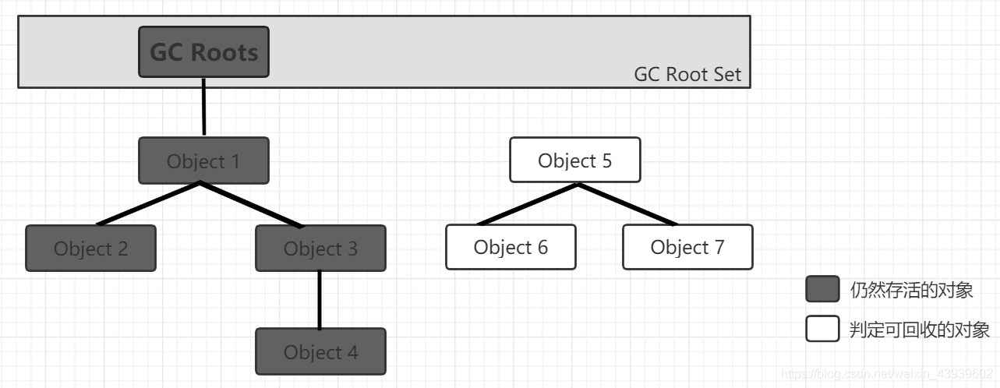
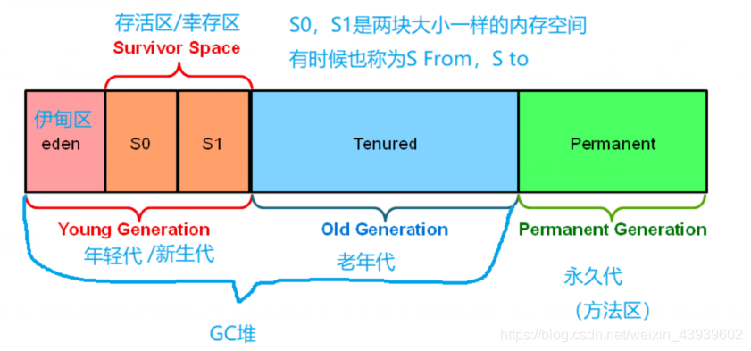

>由于我对GC的理解一直不好，总是记不住，所以本篇博客完全撸了[一颗苹果的博客](https://blog.csdn.net/weixin_43939602/article/details/117948764),十分感谢原作者！

## 什么是垃圾

Java进程运行后，如果某个**类型(方法区中的类信息，堆中的类对象)，常量，对象**，如果不可用，就成了垃圾。

提炼一下，垃圾的分类：

- 类型
- 常量
- 变量

## 谁负责具体的回收

GC线程负责具体回收工作，GC线程是个守护线程。

## 回收的时机

创建对象时，需要再对应的内存区域分配内存空间，如果该区域的空间不足，就会触发该区域的GC。

`System.gc()`方法可**建议GC**，但是不能确保一定GC。

## 垃圾判定算法

### 引用计数法

给对象增加一个引用计数器，每当增加一个引用时，计数器自加1；当引用失效时，计数器自减1；当计数器为0时被判定为垃圾。

**问题：当出现循环引用会无法GC。**

### 可达性分析法

以`GC Root`对象作为起点，向下搜索，搜索的路径佳作“引用链”。当一个对象到GC Roots没有任何引用链相连时（不可达）,说明这个对象是垃圾。



### Java的四种引用类型

#### 强引用

```java
Object o = new Object();
```

只要是`new`出来的都是强引用，只要可达，就不能被回收，就算内存不足，JVM也只会抛出OOM异常。

#### 软引用

```java
SoftReference<Object> sr = new SoftReference<>(new Object());
```

即使是可达的,但是一旦该区域空间不足(OOM)，就会被GC。

#### 弱引用

```java
WeakReference<Object> sr = new WeakReference<>(new Object());
```

即使是可达的，但是一旦该区域发生GC，也会被同时GC掉。

#### 虚引用

这货基本不用，随时都有可能被回收，看心情？

#### 回收优先级

**虚引用->弱引用->软引用->强引用**

## GC的位置



从上图中可以看到JVMM划分成了两大块三大区和三小区：

1. 年轻代GC非常频繁，回收效率也高。
2. 老年代GC速度比年轻代慢10倍以上。
3. 永生代GC频率非常低，在jdk1.7叫方法区，1.8叫原空间。

## GC算法

### 标记清除法

先标记不可达对象，再一次性释放所有标记过的对象。

特点：

- 标记时只要找到一个引用就可证明对象存活着；
- 不移动对象位置；
- 由于两个阶段都采用遍历+递归的形式，所以两个阶段效率都不高；
- 回收后存在**内存碎片**，造成空间浪费。

内存碎片：当创建非常大的对象时，一块区域不够用，所以JVM会给该对象分配另一块相连的区域；而GC时只会回收其中一块区域，另一块区域不会被回收，就形成了碎片。

### 复制算法（新生代采用）

**将可用内存按容量划分为大小相等的两块**，每次只使用其中的一块。当这块内存需要进行垃圾回收时，会将此区域还**存活着的对象**复制到另一块上面，然后再把已经使用过的内存区域一次清理掉。

特点：

- 效率高
- 没有碎片问题
- 从原理上看浪费了一半空间

### 标记整理算法（老年代采用）

标记出存活的对象，然后**移动**到另一块区域，再清理剩余内存。

特点：

- 如果存活对象过多，会产生较多复制操作，导致效率低；
- 没有碎片。

### 分代收集算法（JVM的整体算法）

就是分成若干区域，什么新生代、老年代、永生代，然后进一步细分区域，每个区域采用不同的GC算法：

- 新生代：对象生存周期短，每次回收会释放大量对象，所以采用复制算法；
- 老年代：对象存活率较高，没有额外的空间进行分配担保，所以采用标记整理算法。

## 鸣谢：

[老莫8](https://blog.csdn.net/laomo_bible/article/details/83112622)
[一颗苹果](https://blog.csdn.net/weixin_43939602/article/details/117948764)
