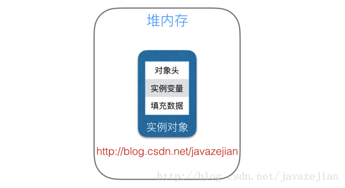

## 并发三大特性

- 原子性    操作要么成功，要么失败，中途不可被中断。
- 可见性    共享变量的变更立即可见。
- 有序性    程序执行依照代码的先后顺序来执行。

## JMM模型

JMM的原则是数据拷贝，会从主存拷贝到CPU缓存，再拷贝到CPU寄存器。CPU寄存器的速度远高于缓存，缓存的读写速度远高于主存。当一个线程在寄存器中修改了数据，而没有同步到主存时，另一线程从主存读取了过期的数据，造成数据不同步问题。解决方式是同步访问（加锁）或者通过`volatile`强制刷写到主存。

## 指令重排序

**如果不存在数据依赖性**，为了提高性能，编译器和cpu会在不改变程序执行结果的前提下对指令重新排序。

## JMM内存屏障

- LoadLoad   可保障：在执行屏障后面的所有读取操作之前，屏障前面的读取操作全部完成。
- StoreStore  可保障：在执行屏障后面的所有写入操作之前，屏障前面的写入操作全部完成。
- LoadStore 可保障：在执行屏障后面的所有写入操作之前，屏障前面的读取操作全部完成。
- StoreLoad 可保障：在执行屏障后面的所有读取操作之前，屏障前面的写入操作全部完成。

## volatile

符合可见性和有序性，不保证原子性。

通过在编译器生成字节码时，在指令序列中添加**内存读写屏障**来禁止指令重排序，保障了可见性和有序性，不能保证原子性。

JVM会在volatile修饰的变量前后都加上内存屏障，保证有序性：

1. LoadLoadBarrier
2. volatile读操作
3. LoadStoreBarrier
4.  
5. StoreStoreBarrier
6. volatile写操作
7. StoreLoadBarrier

## synchronized

符合并发编程的三大特征。

- 修饰实例方法，作用于当前实例加锁，进入同步代码前要获得当前实例的锁;
- 修饰静态方法，作用于当前类对象加锁，进入同步代码前要获得当前类对象的锁;
- 修饰代码块，指定加锁对象，对给定对象加锁，进入同步代码库前要获得给定对象的锁。



原理是对象头中存在访问计数、偏向锁、轻量锁。

从jvm层面锁就是监视器`monitor`。持有或者重入monitor会使计数器自加1。释放时计数器归0，其他线程才能持有monitor。

## 对象锁操作

* `void wait()` 导致一个线程进入等待状态，直到它得到通知。该方法只能在一个同步方法或同步块中调用。如果当前线程不是对象锁的持有者，会抛出异常。
* `void notify()` 随机选择一个在这个对象上调用wait方法的线程，接触其阻塞状态。
* `void notifyAll()` 解除所有被wait阻塞的线程。

用法：

``` java
public class MainActivity extends AppCompatActivity {

    private final Data data = new Data();

    Runnable runnable1 = new Runnable() {
        @Override
        public void run() {
            synchronized (data) {
                try {
                    if(!Thread.currentThread().isInterrupted() && data.getNum() < 1){
                        data.wait();
                    }
                    Log.d("子线程", "run: 收到了通知，此时num值为" + data.getNum());
                } catch (InterruptedException e) {
                    e.printStackTrace();
                }
            }
        }
    };

    Runnable runnable2 = new Runnable() {
        @Override
        public void run() {
            synchronized (data) {
                data.setNum(1);
                data.notifyAll();
            }
        }
    };

    private Thread t1, t2;

    @Override
    protected void onCreate(Bundle savedInstanceState) {
        super.onCreate(savedInstanceState);
        setContentView(R.layout.activity_main);

        t1 = new Thread(this.runnable1);
        t1.start();
    }

    public void start(View v) {
        t2 = new Thread(this.runnable2);
        t2.start();
    }

    private static class Data {
        private int num;

        public int getNum() {
            return num;
        }

        public void setNum(int num) {
            this.num = num;
        }
    }
}
```

## 原子类型

- AtomicInteger
- AtomicIntegerArray
- AtomicIntegerFieldUpdater
- AtomicLong
- AtomicBoolean
- AtomicReference

原理： `private volatile int value;` 内部值带有 `volatile`保证可见性和有序性，通过`Unsafe`的底层能力保证原子性。

## 重入锁ReentrantLocak

重入锁：线程可以反复获得已拥有的锁。

``` java
//构造一个重入锁
new reentrantLocak();

//构造一个公平锁
new reentrantLocak(boolean fair);
```

公平锁倾向于等待时间最长的吓成，可能严重影响性能。

## 读写锁ReadWriteLock。

## 锁分类

- 公平锁、非公平锁：公平锁指多个线程按照申请锁的顺序来获取锁，非公平锁就是没有顺序完全随机，所以能会造成优先级反转或者饥饿现象；synchronized 就是非公平锁，ReentrantLock（使用 CAS 和 AQS 实现） 通过构造参数可以决定是非公平锁还是公平锁，默认构造是非公平锁；非公平锁的吞吐量性能比公平锁大好。

可重入锁：又名递归锁，指在同一个线程在外层方法获取锁的时候在进入内层方法会自动获取锁，synchronized 和 ReentrantLock 都是可重入锁，可重入锁可以在一定程度避免死锁。

独占锁、共享锁：独享锁是指该锁一次只能被一个线程持有，共享锁指该锁可以被多个线程持有；synchronized 和 ReentrantLock 都是独享锁，ReadWriteLock 的读锁是共享锁，写锁是独占锁；ReentrantLock 的独享锁和共享锁也是通过 AQS 来实现的。

互斥锁、读写锁：其实就是独享锁、共享锁的具体说法；互斥锁实质就是 ReentrantLock，读写锁实质就是 ReadWriteLock。

乐观锁、悲观锁：这个分类不是具体锁的分类，而是看待并发同步的角度；悲观锁认为对于同一个数据的并发操作一定是会发生修改的（哪怕实质没修改也认为会修改），因此对于同一个数据的并发操作，悲观锁采取加锁的形式，因为悲观锁认为不加锁的操作一定有问题；乐观锁则认为对于同一个数据的并发操作是不会发生修改的，在更新数据的时候会采用不断的尝试更新，乐观锁认为不加锁的并发操作是没事的；由此可以看出悲观锁适合写操作非常多的场景，乐观锁适合读操作非常多的场景，不加锁会带来大量的性能提升，悲观锁在 java 中很常见，乐观锁其实就是基于 CAS 的无锁编程，譬如 java 的原子类就是通过 CAS 自旋实现的。

分段锁：实质是一种锁的设计策略，不是具体的锁，对于 ConcurrentHashMap 而言其并发的实现就是通过分段锁的形式来实现高效并发操作；当要 put 元素时并不是对整个 hashmap 加锁，而是先通过 hashcode 知道它要放在哪个分段，然后对分段进行加锁，所以多线程 put 元素时只要放在的不是同一个分段就做到了真正的并行插入，但是统计 size 时就需要获取所有的分段锁才能统计；分段锁的设计是为了细化锁的粒度。

偏向锁、轻量级锁、重量级锁：这种分类是按照锁状态来归纳的，并且是针对 synchronized 的，java 1.6 为了减少获取锁和释放锁带来的性能问题而引入的一种状态，**其状态会随着竞争情况逐渐升级，锁可以升级但不能降级**，意味着偏向锁升级成轻量级锁后无法降为偏向锁，这种升级无法降级的策略目的就是为了提高获得锁和释放锁的效率。

自旋锁：其实是相对于互斥锁的概念，互斥锁线程会进入 WAITING 状态和 RUNNABLE 状态的切换，涉及上下文切换、cpu 抢占等开销，自旋锁的线程一直是 RUNNABLE 状态的，一直在那循环检测锁标志位，机制不重复，但是自旋锁加锁全程消耗 cpu，起始开销虽然低于互斥锁，但随着持锁时间加锁开销是线性增长。

可中断锁：synchronized 是不可中断的，Lock 是可中断的，这里的可中断建立在阻塞等待中断，运行中是无法中断的。
