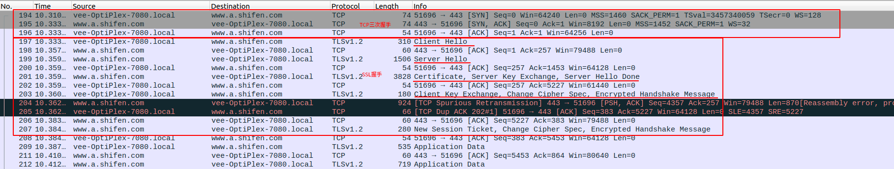
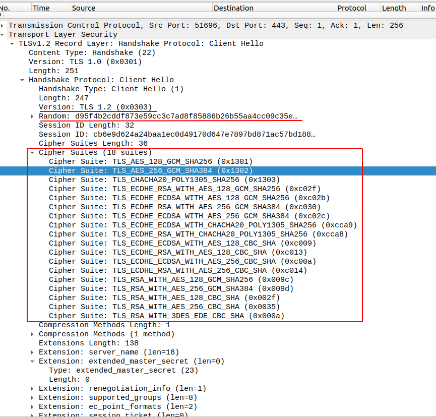
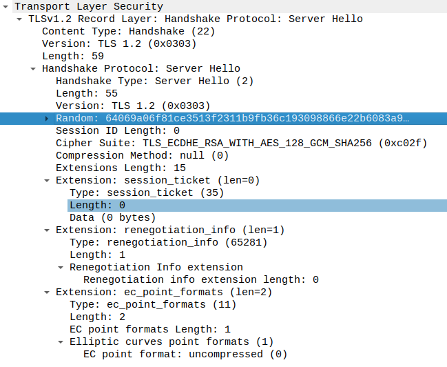
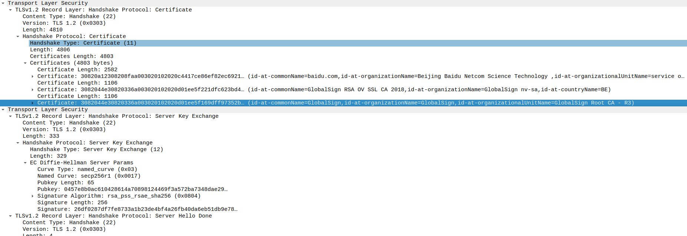
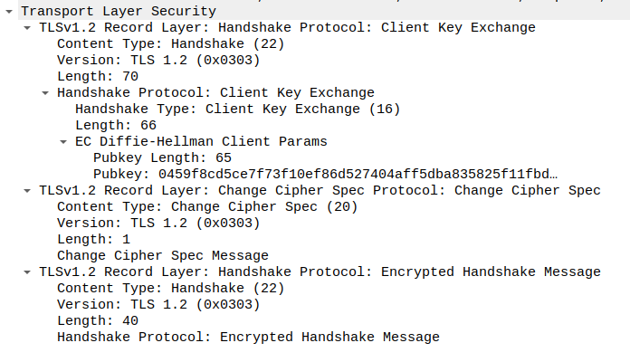

# HTTPS

<!--more-->

### HTTPS

通过在TCP层之上引入`SSL`或`TLS`层，对数据进行非对称加密，接收端通过公钥来解密，以验证对方身份以及数据完整性保护。主要用来防止中间人攻击。

由**对称加密**和**非对称加密**共同保障安全性。

#### 流程：

1. TCP三次握手；
2. 客户端生成一个随机数R1，结合自己支持的加密算法上报服务端443端口；
3. 服务端会保留R1，选择一个共同支持的算法，并生成随机数R2，连同颁发机构的数字证书（含公钥）下放给客户端；
4. 客户端通过内置的根证书验证数字证书的合法性（如果根证书信任该证书）；
5. 证书验证通过后就能解析出公钥，客户端生成R3，通过公钥非对称加密后上报服务端；
6. 双方通过约定的加密算法，汇总R1、R2、R3生成各自的key，开始对称加密通讯。

## 抓包

通过抓包，可以看到SSL握手是在TCP握手之后进行的，所以Https是基于TCP的。

## SSL握手过程

### client hello

- Version 支持的最高TLS协议版本；
- Random  客户端生成的随机数random_C，用于后续的对陈密钥生成；
- Cipher Suites 客户端支持的加密套件cipher suites列表，每个加密套件对应四个功能的组合：
  - 认证算法Au（身份认证）
  - 密钥交换算法KeyExchange（密钥协商）
  - 对称加密算法Enc（信息加密）
  - 信息摘要算法Mac（完整性校验）
- Compression Methods 支持的压缩算法列表，用于后续的信息压缩传输；
- Extensions  扩展字段，支持协议与算法的相关参数以及其他辅助信息等，常见的SNI就属于扩展字段。

服务端接收到[client hello]后，返回[ACK]。

### server hello

- Version 协商使用的TLS协议版本
- Random  服务端生成的随机数random_S
- Cipher Suite  协商选择的加密套件
- Compression 协商选择的压缩算法

服务端接收到[server hello]后，返回[ACK]。

### server hello done

- Certificates 服务端证书链
- Server key exchange 
- Server hello done 通知客户端[server hello]信息发送结束。

### Client Key Exchange, Change Cipher Spec, Encrypted Handshake Message

- client_key_exchange 合法性验证通过后，客户端计算产生随机数，并用证书公钥加密，发送给服务器，服务器计算产生Pre-master,结合前面的random_C和random_S一起生成协商密钥，用于后面的对衬加密；
- change_cipher_spec  客户端通知服务器后续通信都采用协商的通信密钥和加密算法进行加密通信；
- encrypted_handshake_message 服务器会采用当前的同系年参数信息生成一段数据并采用协商密钥session secret与算法加密并发送到客户端。
