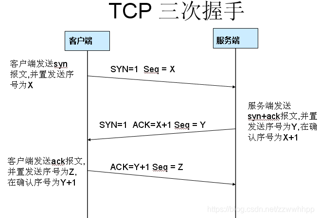
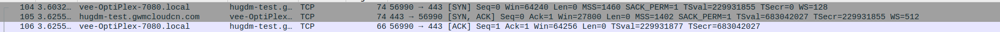
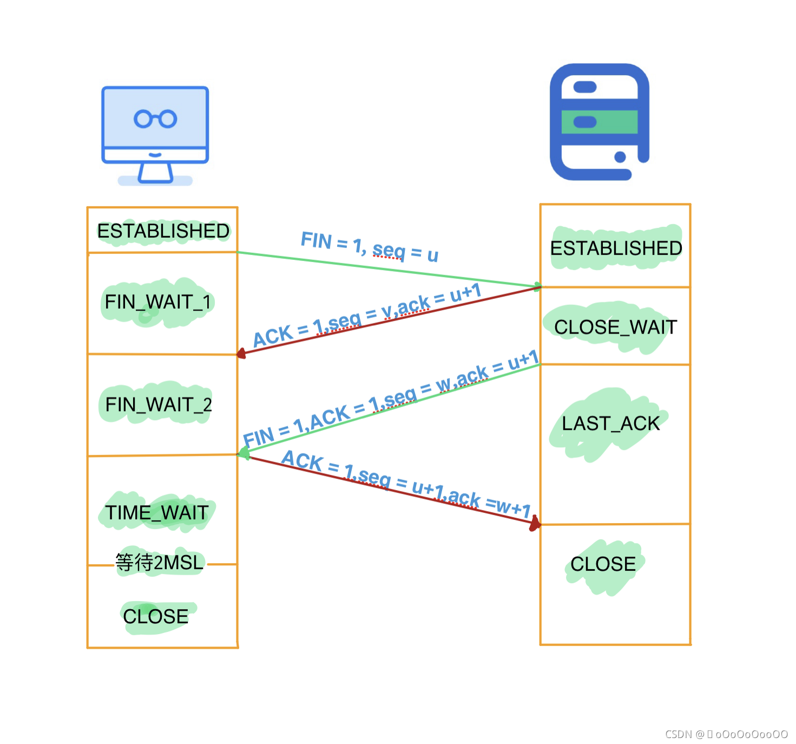

# TCP协议

<!--more-->

## 三次握手

1. client->server:443 : [SYN]       Seq=0
2. server:443->client : [SYN,ACK]   Seq=0 Ack=1
3. client->server:443 : [ACK]       Seq=1 Ack=1

### 第一次握手：clent->server

客户端向服务器发送：

- [SYN]：标志位，表示请求建立连接
- Seq=0：数据包的相对序列号，初始为0，为0表示当前还没有发送数据
- Ack=0：已收到包的数量，初始为0，为0表示当前没有收到包

### 第二次握手：server->client

服务端向客户端回复：

- [SYN, ACK]：标志位，表示已收到连接请求，并已回复
- Seq=0：表示还没有发送实际的数据
- Ack=1：表示已收到1个包，这个包就是第一次握手时收到的包，虽然没有实际数据

### 第三次握手:client->server

客户端再次发送确认包(Ack)SYN标志位为0，ACK标志位为1，并把服务器发送来的ACK序号+1

- [ACK]：标志位，表示已经收到记录
- Seq=1：表示当前已经发送1个数据包
- Ack=1：表示已收到数据的位数为1

>三次握手之后，直接就开始SSL握手，然后是正常数据交互，当没有交互时，还会连接保活(keep alive)，当保活一定的时间之后，就开始四次挥手了。

## 四次挥手

>目前我实际抓包下来，发现与网络上的对不上，可能是受到了keepAlive的干扰。目前了解到的信息是，由于是全双工通信，服务端和客户端都可以主动结束连接，其他的过程后面再补吧。
